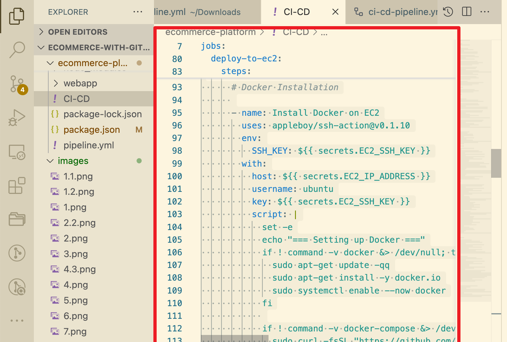

# E-Commerce with GitHub Actions
## Capstone Project: E-Commerce Application CI/CD Pipeline
## Project Overview
This project implements a fully **automated CI/CD pipeline** for a full-stack **E-Commerce Platform** using **GitHub Actions**. The application consists of two main components:

* E-Commerce API: A Node.js/Express backend responsible for product listings, user accounts, and order processing.
* E-Commerce Frontend: A React web application allowing users to browse products, manage accounts, and place orders.
The main goal is to ensure continuous integration and continuous delivery using GitHub Actions, Docker, and cloud deployment.

# Project Tasks
## Task 1: Project Setup
* Create a git repository naming it E-commerce-platform


* Inside the directory create web app and api folder image

## Task 2: Initialize Github actions

* Create your workflows folder image


## Task 3: Backend api setup

* Set up a Node.js/Express application inside the api/ directory.

* Add basic features:

  * Product listing
  * User account management
  * Order processing
* Add unit tests using Jest or Mocha.

```
name: Backend CI

on:
  push:
    branches: [ main ]
  pull_request:
    branches: [ main ]

jobs:
  test:
    runs-on: ubuntu-latest
    
    steps:
    - uses: actions/checkout@v3
    
    - name: Setup Node.js
      uses: actions/setup-node@v3
      with:
        node-version: '18'
        cache: 'npm'
        cache-dependency-path: ecommerce-platform/api/package-lock.json
        
    - name: Install dependencies
      run: npm ci
      working-directory: ecommerce-platform/api
      


    - name: Build Docker image
      run: docker build -t ecommerce-test .
      working-directory: ecommerce-platform/api
```


## Task 4:  Frontend Web Application Setup
* Set up a React app inside the webapp/ directory.

* Connect to the backend API.

* Implement key UI features:

  * Product display
  * User login
  * Order placement

```
name: Frontend CI

on:
  push:
    branches: [ main ]
  pull_request:
    branches: [ main ]

jobs:
  test:
    runs-on: ubuntu-latest
    
    steps:
    - uses: actions/checkout@v3
    
    - name: Setup Node.js
      uses: actions/setup-node@v3
      with:
        node-version: '18'
        
    - name: Install dependencies
      run: npm ci
      working-directory: ecommerce-platform/api
      

    - name: Build application
      run: npm run build
      working-directory: ecommerce-platform/webapp

```

    


## Task 5: Continous integration Workflow
* Create GitHub Actions workflows for backend and frontend.

* Each workflow should:

  * Install dependencies
  * Run tests
  * Build the application


Workflow that installs dependencies, runs tests and builds the application

 ```yaml
 name: CI/CD Pipeline

   on:
 push:
   branches: [main]

   jobs:
    build-and-test:
    runs-on: ubuntu-latest
    steps:
- name: Checkout repository
  uses: actions/checkout@v3

- name: Set up Node.js
  uses: actions/setup-node@v3
  with:
    node-version: '16'

# Backend
- name: Install backend dependencies
  working-directory: ./server
  run: npm install

- name: Run backend tests
  working-directory: ./server
  run: npm test

# Frontend
- name: Install frontend dependencies
  working-directory: ./public
  run: npm install

- name: Build frontend
  working-directory: ./public
  run: npm run build
```


### Task 6: Docker integration
Create Dockerfiles in both api/ and webapp/ directories.

* Modify your workflow to build docker the images

# Dockerisation
- name: Set up Docker Buildx
  uses: docker/setup-buildx-action@v2

- name: Log in to Docker Hub
  uses: docker/login-action@v2
  with:
    username: ${{ secrets.DOCKER_USERNAME }}
    password: ${{ secrets.DOCKER_PASSWORD }}

- name: Build and push Backend image
  uses: docker/build-push-action@v4
  with:
    context: .
    file: ./server/Dockerfile
    push: true
    tags: Samjean50/ecommerce-app-backend:latest

- name: Build and push Frontend image
  uses: docker/build-push-action@v4
  with:
    context: ./public
    file: ./public/Dockerfile
    push: true
    tags: Samjean50/ecommerce-app-frontend:latest

## Task 7: Deploy to the Cloud
* Choose AWS as the cloud provider.
* Set up an EC2 instance to host the backend.
* Use GitHub Actions to:
  * Upload Docker images to EC2 using scp
Choose a Cloud platform image
    Deployment
  - name: Deploy Containers
    uses: appleboy/ssh-action@v0.1.10
    with:
      host: ${{ secrets.EC2_IP_ADDRESS }}
      username: ubuntu
      key: ${{ secrets.EC2_SSH_KEY }}
      script: |
        set -ex
        echo "=== Starting Deployment ==="
        cd /home/ubuntu
        
        # Stop and clean up old containers
        docker-compose down || true
        docker system prune -af  # Cleanup unused images
        docker pull Samjean50/ecommerce-app-backend:latest
        docker pull Samjean50/ecommerce-app-frontend:latest
        docker-compose up -d --force-recreate
        echo "=== Running Containers ==="
        docker ps -a
        echo "=== Network Status ==="
        docker network ls
Ensure all required credentials are stored github secrets


Configure workflow to deploy updates when codes are pushed to main

Implementing caching
It was implemented after the steps for installing the modules so that it can be cached

## Task 8: Continuous Deployment
* Set up workflows to automatically deploy whenever code is pushed to the main branch.

* Backend workflow example:

```
on:
  push:
    branches:
      - main
```

## Task 9: Performance and Security
* Implement Docker layer caching to speed up build times.

* Use GitHub Secrets to store:

  * Cloud credentials
  * API keys
  * JWT secrets
  * Database connection strings


## Task 10: Documentation
* Document the project setup, structure, workflow, and instructions for local development in this README.md file.

## 🔧 Local Development Instructions
**Backend (API)**
```
git clone https://github.com/your-username/ecommerce-platform.git
cd ecommerce-platform/api
npm install
npm run dev
```

**Frontend (WebApp)**
```
cd ../webapp
npm install
npm start
```

**Docker Build and Run Locally**
```
docker build -t ecommerce-api ./api
docker run -d -p 5000:5000 --name ecommerce-api ecommerce-api
```
## 🌐 Deployment Instructions
**Using GitHub Actions**
* Workflow is automatically triggered on push to main.

* CI/CD steps include:

  * Build Docker image
  * Save image
  * Upload image to EC2
  * SSH into EC2 and deploy container

## Manual Deployment (if needed)
```scp -i your-key.pem ecommerce-api.tar ubuntu@<EC2_HOST>:/home/ubuntu/
ssh -i your-key.pem ubuntu@<EC2_HOST>
docker load < ecommerce-api.tar
docker stop ecommerce-api || true
docker rm ecommerce-api || true
docker run -d -p 80:5000 --name ecommerce-api ecommerce-api
```

## 🎓 Technologies Used
* Backend: Node.js, Express
* Frontend: React.js
* CI/CD: GitHub Actions
* Containerization: Docker
* Cloud Hosting: AWS EC2

## 🔐 GitHub Secrets Required
Secret Name	Purpose
EC2_HOST	EC2 Public IP or DNS
EC2_SSH_KEY	SSH private key for EC2
DB_PASSWORD	Backend DB authentication
JWT_SECRET	JWT signing token
API_KEY	Any third-party API credentials

## 🚧 Security Measures
Secrets are never hard-coded
All credentials are stored in GitHub Secrets
SSH keys are used instead of passwords

## ✨ Conclusion
This Capstone Project offers hands-on experience in building and deploying a real-world E-Commerce application with full CI/CD automation using GitHub Actions. It includes:

* Full-stack development
* Dockerization
* Cloud deployment
* Secure secrets management
* Performance optimization
It demonstrates the end-to-end DevOps lifecycle, making it ideal for developers and DevOps engineers looking to master modern deployment pipelines.

## 📖 Additional Resources
[Node.js Documentation](|https://devdocs.io/node/)

[React Documentation](https://devdocs.io/react/)

[Docker Documentation](https://docs.docker.com/)

[GitHub Actions Docs](https://docs.github.com/en/actions)

Cloud Platform Guides:

[AWS](https://docs.aws.amazon.com/)
[Google Cloud](https://cloud.google.com/docs/)

⚠️ Note: Customize EC2 IP and secrets in your workflow before using this project in production.
